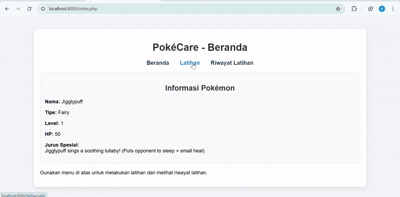

# Responsi Praktikum PBO – PokéCare

# Data Diri
Nama       : Nur Syafika  
NIM        : H1H024023  
Shift Awal : C
Shift Akhir: A

# Pokémon
Saya mendapatkan Pokémon Jigglypuff yang bertipe Fairy.  
Jigglypuff memiliki kemampuan spesial berupa lullaby yang membuat lawan tertidur.

# Struktur Folder Project
Nursyafika_H1H024023_ResponsiPBO25  
 ├── index.php  
 ├── latihan.php  
 ├── history.php  
 ├── README.md  
 ├── classes  
 │     ├── Pokemon.php  
 │     └── FairyPokemon.php  
 ├── data  
 │     ├── data_handler.php  
 │     └── sessions.json  
 └── assets  
       └── style.css  

# Penjelasan Aplikasi
Aplikasi PokéCare dibuat menggunakan PHP Native dengan konsep OOP.  
Pengguna dapat melihat informasi Pokémon, melakukan latihan, dan melihat riwayat latihan yang disimpan ke dalam file JSON.

# Penjelasan Kode
Class Pokemon menyimpan atribut dasar Pokémon dan method train untuk menaikkan level dan HP.  
Class FairyPokemon mewarisi dari Pokemon dan mengoverride specialMove sesuai karakter Jigglypuff.  
File latihan.php mengatur proses latihan dan menyimpan hasilnya.  
File history.php menampilkan seluruh data latihan yang pernah dilakukan.  
File data_handler.php mengelola penyimpanan dan pembacaan JSON.

# Konsep OOP yang Digunakan
Encapsulation digunakan untuk melindungi atribut Pokémon.  
Inheritance digunakan melalui class FairyPokemon.  
Polymorphism diterapkan lewat override specialMove.  
Abstraction ada pada penyembunyian proses training di method train.

# Cara Menjalankan Aplikasi
Masuk ke folder project melalui CMD:

cd "D:\TRIPIO PENTING\Nursyafika_H1H024023_ResponsiPBO25"

Jalankan server PHP:

php -S localhost:8000

Aplikasi dapat diakses melalui browser:

http://localhost:8000

# Demo Aplikasi (GIF)

